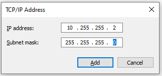

# CIFS-over-SSH: Access to multiple remote hosts, no Kerberos
*(tested Win10 1809,1909,20H2,21H1,21H2)*

## Introduction

This tutorial contains screenshots for the English version of Windows 10.


To be able to mount a Windows share on a single remote host over SSH we will need 

- Administrator access to the local computer, including the ability to 
  *elevate* privileges. If you don't know what I am talking about then 
  stop reading right here.
- One real or virtual network adapter, **NOT** bound to the
  *Client for Microsoft Networks* driver.

- One real or virtual network adapter, bound to the *Client for Microsoft Networks*
  driver.

Normally you should already have such an adapter, as otherwise you
would not be able to mount any Windows shares.


This part of the tutorial is split into the following steps:

1. As most people do not have a spare real network adapter in their computer,
   we will add an extra virtual network adapter by
   <a href="#installing-the-loopback-adapter">installing</a> the **Microsoft KM-TEST Loopback Adapter**.
2. After that, the network adapter must be properly
   <a href="#configuring-the-loopback-adapter">configured</a>.
3. Starting with Windows 10 update 1903, the Windows 10 feature "SMB 1.0" must be 
   <a href="#disabling-the-smb-10-windows-feature">turned off</a>.
4. Furthermore, a few Windows system services need to be
   <a href="#tweaking-the-lanmanserver-service">tweaked</a>.
5. Next, reboot Windows to <a href="#reboot-and-verify">verify</a> that we've been able to 
   grab port 445 and to see if the `lanmanserver` service is up and running.
6. Finally, we launch a special OpenSSH session and 
   <a href="#mapping-a-network-drive">mount</a> our remote share.

7. For those wishing to <a href="#controlz-undo-undo">undo</a> the above steps follow the 
   instructions at the bottom of this page.


#### Windows 10 Upgrade woes

Multiple persons have reported problems after a major Windows 10 upgrade (e.g. from 1803 to 1809).
This is due mostly to the disappearance of the **Microsoft KM-TEST Loopback Adapter**
and of the `portproxy` rule.  In order to recover after a Windows 10 upgrade, try

- Redo step 1 and reboot
- If the adapter is still not present, run the `devmgmt.msc` management console application and
  choose **View->Show Hidden devices** to see you can find the adapter again. If not, redo step 2.
- Redo steps 3, 4 and 5.


## Installing the Loopback Adapter

To install the Loopback adapter follow these steps:
- Start the `Add Hardware Wizard` by either going
  **Start->Settings->Control Panel->Add Hardware** or by
  starting a console window with elevated (Administrator) privileges.
  In the console window type
```
  hdwwiz.exe
```
- The Hardware Wizard will come up:

  

  Click **Next** to continue

- 

  Select **Install the hardware that I manually select from a list**
  and click **Next**.
- Now you'll see:

  

  Select the entry **Network adapters** and click **Next**.
- In the next screen

  

  first select **Microsoft** from the list of *Manufacturers*
  and then select **Microsoft KM-TEST Loopback Adapter** from the
  list of *Network Adapters*. Finally, click **Next** once more.
- Almost finished:

  

  This is your last chance to abort, otherwise, click **Next**.
- After a while you should see:

  

  Click **Finish** to exit the Hardware Wizard.


You are now ready to configure your newly installed Loopback adapter. Even though
Windows might not ask you to, reboot anyways (heey, it's a Microsoft OS ;-)).


From reports I've seen on the Internet a reboot is sometimes required for the
loopback adapter to come up properly.


## Configuring the Loopback Adapter

Now that your newly installed loopback adapter is up and running we must configure
it properly:

- Go to the **Network Connections Center**:

  

- Choose the loopback adapter (usually it is named something like "Local Area Connection #3")
  and right-click on it:

  

- Choose **Properties**, after which a new window will appear

  

  Make sure that
  - the entry **Client for Microsoft Networks**
    is **NOT** enabled, i.e. does not have a checkmark in front of it.
  - the entry **File and Printer sharing for Microsoft Networks**
    is **NOT** enabled, i.e. does not have a checkmark in front of it.
  - the entry **Internet Protocol (TCP/IP)** *is* enabled.

- Select the entry **Internet Protocol (TCP/IP)**, then click on **Properties**.
- A new window will appear:

  

  Select **Use the following IP address** and fill in for the  'IP address' **10.255.255.1**
  and for the 'Subnet mask' **255.255.255.0**. This IP address will be used to mount
  shares from the first remote host.

  It is not necessary to fill in the 'Default gateway' or a 'DNS server'.

- Click on **Advanced** to make the following window appear:

  

  Deselect **Automatic metric** and fill in the value of **9999**
  as the 'Interface metric' as shown above.

- In the same window, click on the button **Add** in the block labeled **IP addresses**.
  A new window will pop up:

  

  Add an IP address for each of the *extra* remote hosts that you want to mount shares from.

  For example, if you need to mount shares from 3 different servers, repeat this step twice,
  filling in 'IP Address' = **10.255.255.2**, 'Subnet mask' = **255.255.255.0** and
  'IP Address' = **10.255.255.3**, 'Subnet mask' = **255.255.255.0**.

- Click on the **WINS** tab:

  

  and select **Disable NetBIOS over TCP/IP**.

- Click on **OK**.
- You are now back in the main 'TCP/IP Properties' screen. Click **OK** again.
- You are now back in the main 'Loopback Properties' screen. Click **Close**.


## Disabling the 'SMB 1.0' Windows feature

Starting with Windows 10 update 1903 we need to disable the Windows feature `SMB 1.0`:

- Go to the **Control Panel->Programs->Programs and Features** and select
  **Turn Windows features on or off**
- A list of features pops up:

  

  Scroll down and deselect the feature **SMB 1.0/CIFS File Sharing support**
- Now close this control panel item. 


*(Thanks to Michael Uhlenberg for pointing this out)*

## Tweaking the 'LanmanServer' service

First, we need to tweak a Windows system service to overcome the thing that 
Microsoft broke. The root cause of the problem is that we need to access the 
file share using TCP port **445**. However, when Windows boots, this port is 
grabbed by the system `lanmanserver` service for all interfaces.


If we can insert a `portproxy` rule to grab port 445 for the loopback
interface **before** the `lanmanserver` service starts, we can circumvent this.
Be aware that `portproxy` rules are executed by the `iphlpsvc` service.


By adding a dependency to the `lanmanserver` service we ensure that the 
`iphlpsvc` service is **always** launched before the `lanmanserver`
service. This section explains how to do this:

- Start a console window with elevated (Administrator) privileges.
- Get the list of service dependencies by typing:

```
  sc qc lanmanserver
```
  You should see output similar to this:

```
[SC] QueryServiceConfig SUCCESS

SERVICE_NAME: lanmanserver
        TYPE               : 20  WIN32_SHARE_PROCESS 
        START_TYPE         : 2   AUTO_START
        ERROR_CONTROL      : 1   NORMAL
        BINARY_PATH_NAME   : C:\WINDOWS\system32\svchost.exe -k netsvcs -p
        LOAD_ORDER_GROUP   : 
        TAG                : 0
        DISPLAY_NAME       : Server
        DEPENDENCIES       : SamSS
                           : Srv2
        SERVICE_START_NAME : LocalSystem
```

  Alternatively, you can use the `Powershell` command

```
  Get-Service -DisplayName server -RequiredServices
```

- Note down the names of the services on which the `Server` service
(also known as `lanmanserver`) depends. In this case, these services
are `samss` and `srv2` (the service names are case independent).

- Change the list of services on which the `lanmanserver` services depends
by adding the `iphlpsvc` service to the list of required services found in the
previous step:

```
  sc config lanmanserver depend= samss/srv2/iphlpsvc
```

**NOTES:**
  - The space after the `"depend= "` is required!
  - Dependencies are separated using slashes ("/").


- Next we add a `portproxy` rule to reroute TCP port 445 to a port of
  our choosing. For this tutorial, I choose **44445**. We need to do this for
  each of the IP addresses that we set up in the previous section:
```
  netsh interface portproxy add v4tov4 listenaddress=10.255.255.1 listenport=445 connectaddress=10.255.255.1 connectport=44445
  netsh interface portproxy add v4tov4 listenaddress=10.255.255.2 listenport=445 connectaddress=10.255.255.2 connectport=44445
  netsh interface portproxy add v4tov4 listenaddress=10.255.255.3 listenport=445 connectaddress=10.255.255.3 connectport=44445
```

  **NOTE**:
  The `connectaddress`  must be identical to the `listenaddress`


If all went well you should see something like


The `portproxy` rule is persistent, so there should be no need to repeat
this step after a reboot.


## Reboot and verify

Of course, now that we have made modifications to the 'Required Services' dependency of the
'LanmanServer' service we have to reboot Windows before proceeding.

- Reboot Windows.
- Verify that the `portproxy` was applied successfully by checking the open ports 
  on the system. Type in a command console
```
  netstat -an | find ":445"
```
  You should see something like:
```
C:\WINDOWS\system32>netstat -an | find ":445"
  TCP    0.0.0.0:445            0.0.0.0:0              LISTENING
  TCP    10.255.255.1:445       0.0.0.0:0              LISTENING
  TCP    10.255.255.2:445       0.0.0.0:0              LISTENING
  TCP    10.255.255.3:445       0.0.0.0:0              LISTENING
  TCP    [::]:445               [::]:0                 LISTENING
```

  If you see **only** '`0.0.0.0:445`' instead then the 'portproxy' rule was 
  not applied correctly.  Verify that the right 'portproxy' rule was used
```
   netsh interface portproxy show v4tov4
```
   and verify that the `IpHlpSvc` service is running at Windows startup using
```
  sc query iphlpsvc
```
  Another reason for the 'port grabbing' to fail could be the `LanmanWorkstation` service 
  running at Windows startup. If so, try giving it the same treatment as `LanmanServer`.
  However, on the Windows 10 installations I tested this service was running at system startup 
  without causing any problems.
- After Windows comes up and you have logged in, check the status of the 'lanmanserver' service. Open
  a command console (no privilege elevation is required) and type
```
  sc query lanmanserver
```
  The 'LanmanServer' service should be in the state **Running**. 
  If it is not, then follow 
  [these steps](https://jjkeijser.github.io/cifs-over-ssh/WinAddTask.html)
  to create a task using the Task Schedule to start it at system startup.

If the port is not grabbed correctly (i.e. no `10.255.255.1:445` in the `netstat` output)
then try the 
[Old driver tweak](https://jjkeijser.github.io/cifs-over-ssh/Win10/Win10ConfigureServices.html)
instructions to see if that works better for you.


## Putting it all together

Now that we have configured both our loopback adapter we can put it all together by launching 
a special OpenSSH connection and mounting the shares from the remote servers `fs1.example.org`,
`fs2.example.org` and `fs3.example.org` as Windows shares:

- Launch an OpenSSH session with some special port-forwarding rules and login on 
  `login.example.org` as normal. Open a Command console or terminal and type:
```
  ssh -v -N -n -L 10.255.255.1:44445:fs1.example.org:445 \
               -L 10.255.255.2:44445:fs2.example.org:445 \
               -L 10.255.255.3:44445:fs3.example.org:445 \
                <Your-userid>@login.example.org
```
  Yes, there are lots of colons in that `-L` option but you need them all.

- The first time you start the command with the special
  port forwarding rules, you will be (probably) be prompted by the Windows
  Defender Firewall that it has blocked some features:

  

  Allow access to at least **Public** networks by ticking the checkbox,
  then click on **Allow access** as otherwise the port-forwarding will not work.
- Make sure port-forwarding is working properly by checking the (verbose) log:

  

  Make sure the line
```
  debug1: Local connections to 10.255.255.1:44445 forwarded to remote address fs.example.org:445
```
    is present before continuing.

- Go to **Start->Run** and type `\\10.255.255.1\`
- In the Console window you should now see a line 
```
  debug1: Connection to port 44445 forwarding to fs.example.org:445 requested.
``` 
  as in the following screenshot:

  

 If this is present then you can decrease the debug logging of the OpenSSH session 
 by removing the `-v` option from the command line:
```
  ssh -N -n -L 10.255.255.1:44445:fs1.example.org:445 \
            -L 10.255.255.2:44445:fs2.example.org:445 \
            -L 10.255.255.3:44445:fs3.example.org:445 \
            <Your-userid>@login.example.org
```
  **Note** 
  If you carefully inspect the above screenshot then you will notice that I am using
  the (built-in) OpenSSH Authentication Agent in combination with an SSH public/private keypair to
  avoid having to type in my password every time.
- You will be prompted to authenticate yourself:

  

  For the *Username*, fill in the domain `DOMAIN\` followed by your userid.
- You should now see your remote share in Windows Explorer!


#### Mapping a network drive

To make life even easier it might be handy to map a network drive to your remote share:

- Start Windows Explorer and choose **Tools->Map Network Drive**.
- In the next screen, fill in:

  

- Choose an available drive letter.
- Do **NOT** click on *Browse* but type in as the *Folder* name: `\\10.255.255.1\<directory>`
- Enable the checkbox in front of **Connect using different credentials**.
- Now click on **Finish**.
- In the next screen, fill in your Windows userid:

  

  For the *Username*, fill in the domain `DOMAIN\` followed by your userid.
- In the next screen, click on **Finish** to complete the network drive mapping.
- You should now see a new drive letter appear in the *Folders* tree-list
  in Windows Explorer. Click on it to verify that you are indeed viewing the remote
  shares from each server.


## Control+Z! Undo! Undo!

For those wishing to undo the CIFS-over-SSH trick follow these steps:

- Start a console window with elevated (Administrator) privileges.
- Restore the dependencies of the `lanmanserver` service by typing
```
  sc config lanmanserver depend= samss/srv2
```
**NOTES**
  - the list of required services may be slightly different on your system. 
    Use the PowerShell command from
    <a href="#tweaking-the-lanmanserver-service">this section</a>
    to obtain a list.
  - the space after the `depend= ` !
- Remove the `portproxy` rules by typing
```
  netsh interface portproxy delete v4tov4 listenaddress=10.255.255.1 listenport=445
  netsh interface portproxy delete v4tov4 listenaddress=10.255.255.2 listenport=445
  netsh interface portproxy delete v4tov4 listenaddress=10.255.255.3 listenport=445
  ....
```
- Remove the firewall rule to allow SSH to do portforwarding from 10.255.255.1:
  - Go to the Windows Control Panel</li>
  - Select **System and Security**, then **Windows Defender Firewall**</li>
  - Select **Allowed apps**, and scroll down in the list to 
    **SSH Telnet and Rlogin client** and deselect the permissions

    

    Then press **OK**
- Start a `Device Manager` by typing
```
  devmgmt.msc
```

- Expand the 'Network Adapters', right-click on **Loopback adapter** and select 
  **Uninstall**.
- If necessary, use the 'Task Scheduler' from the 'Administrative Tasks' menu to delete the
  task 'Start LanmanServer driver'.

