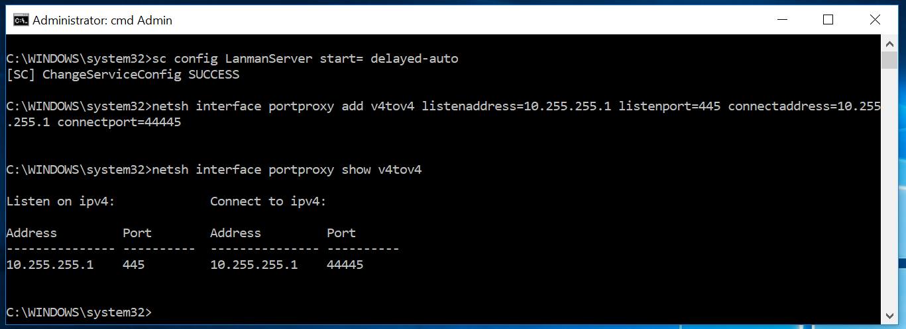
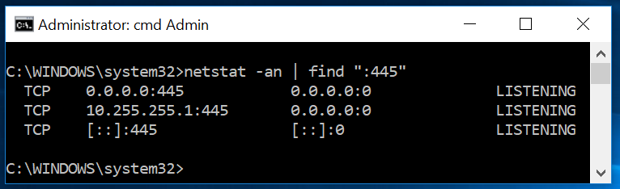
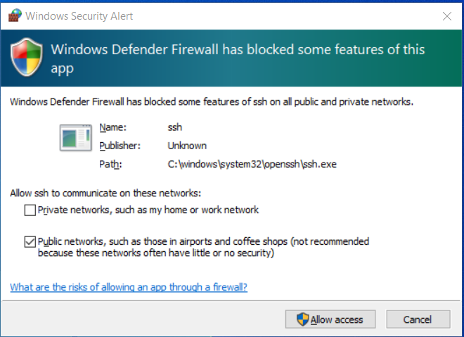
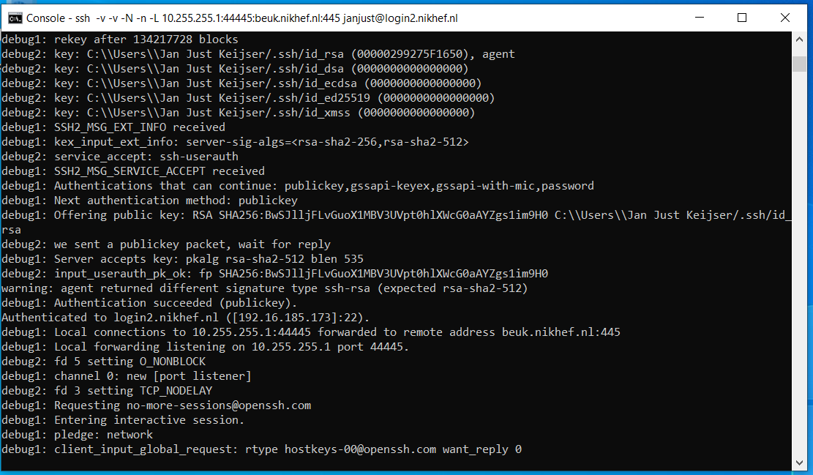
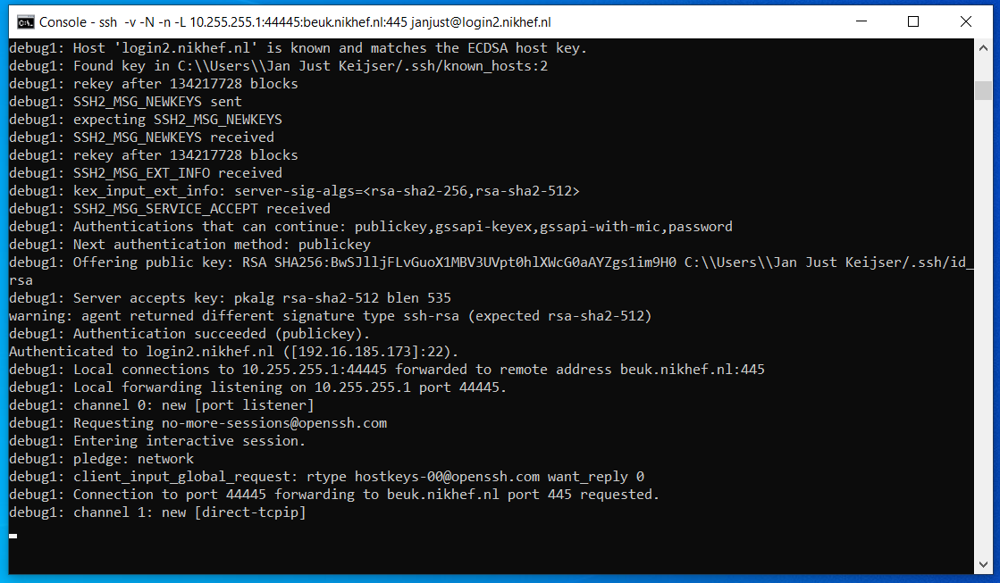
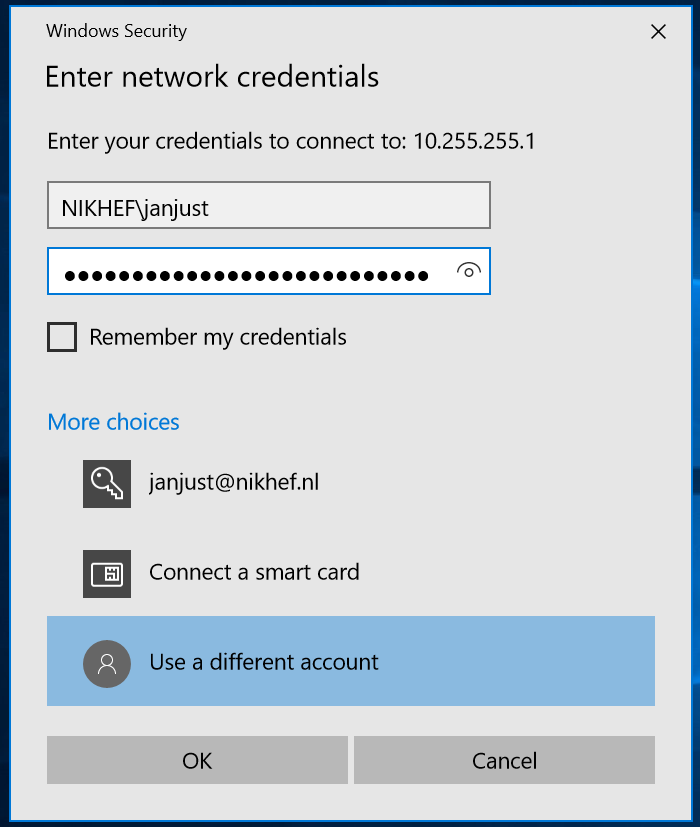
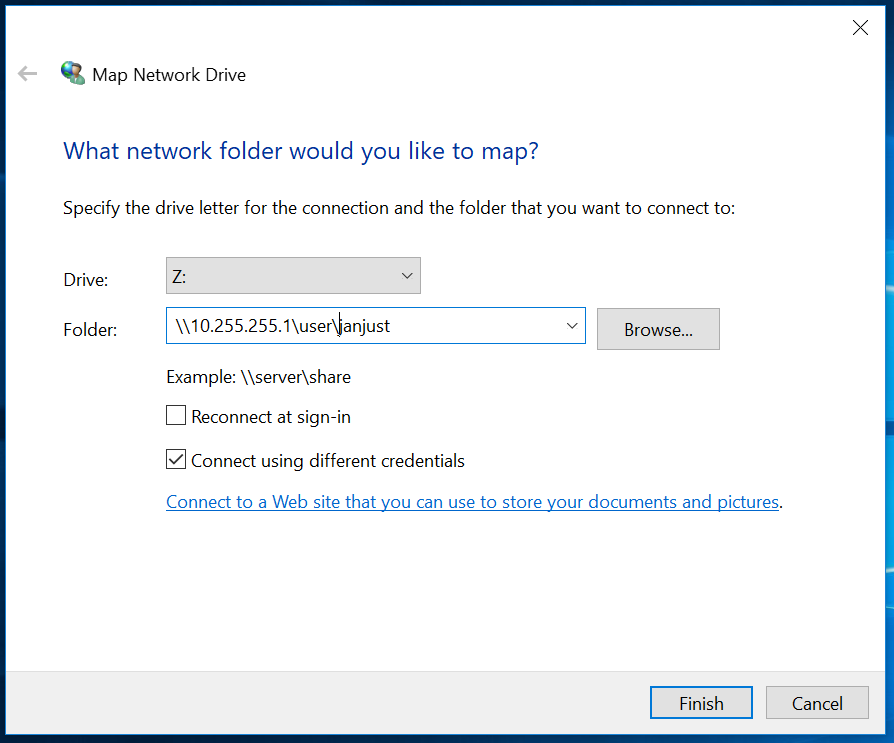

# CIFS-over-SSH for Windows 10: Access to a single remote host, no Kerberos
*(tested Win10 1809,1909,20H2,21H1,21H2)*

## Introduction

This tutorial contains screenshots for the English version of Windows 10.


To be able to mount a Windows share on a single remote host over SSH we will need 

- Administrator access to the local computer, including the ability to 
  *elevate* privileges. If you don't know what I am talking about then 
  stop reading right here.
- One real or virtual network adapter, bound to the *Client for Microsoft Networks*
  driver.

Normally you should already have such an adapter, as otherwise you
would not be able to mount any Windows shares.


This part of the tutorial is split into the following steps:

- Starting with Windows 10 update 1903, the Windows 10 feature "SMB 1.0" must be 
  <a href="#DisableSMB1.0">turned off</a>.
- Furthermore, a few Windows system services need to be
  <a href="#ConfigureServices">tweaked</a>.
- Next, reboot Windows to <a href="#Verify">verify</a> that we've been able to 
  grab port 445 and to see if the `lanmanserver` service is up and running.
- Finally, we launch a special OpenSSH session and <a href="#MountHome">mount</a> our 
  directory.

- For those wishing to <a href="#Undo">undo</a> the above steps follow the 
  instructions at the bottom of this page.


## Disabling the 'SMB 1.0' Windows feature

Starting with Windows 10 update 1903 we need to disable the Windows feature `SMB 1.0`:

- Go to the **Control Panel->Programs->Programs and Features** and select
  **Turn Windows features on or off**
- A list of features pops up:
  
  Scroll down and deselect the feature **SMB 1.0/CIFS File Sharing support**
- Now close this control panel item. 


*(Thanks to Michael Uhlenberg for pointing this out)*

## Tweaking the 'LanmanServer' service

First, we need to tweak a Windows system service to overcome the thing that 
Microsoft broke. The root cause of the problem is that we need to access the 
file share using TCP port **445**. However, when Windows boots, this port is 
grabbed by the system `lanmanserver` service for all interfaces.


If we can insert a `portproxy` rule to grab port 445 for the loopback
interface **before** the `lanmanserver` service starts, we can circumvent this.
Be aware that `portproxy` rules are executed by the `iphlpsvc` service.


By adding a dependency to the `lanmanserver` service we ensure that the 
`iphlpsvc` service is **always** launched before the `lanmanserver`
service. This section explains how to do this:

- Start a console window with elevated (Administrator) privileges.
- Get the list of service dependencies by typing:
```
  sc qc lanmanserver
```
You should see output similar to this:
```
[SC] QueryServiceConfig SUCCESS

SERVICE_NAME: lanmanserver
        TYPE               : 20  WIN32_SHARE_PROCESS 
        START_TYPE         : 2   AUTO_START
        ERROR_CONTROL      : 1   NORMAL
        BINARY_PATH_NAME   : C:\WINDOWS\system32\svchost.exe -k netsvcs -p
        LOAD_ORDER_GROUP   : 
        TAG                : 0
        DISPLAY_NAME       : Server
        DEPENDENCIES       : SamSS
                           : Srv2
        SERVICE_START_NAME : LocalSystem
```

Alternatively, you can use the `Powershell` command
```
  Get-Service -DisplayName server -RequiredServices
```

- Note down the names of the services on which the `Server` service
(also known as `lanmanserver`) depends. In this case, these services
are `samss` and `srv2` (the service names are case independent).

- Change the list of services on which the `lanmanserver` services depends
by adding the `iphlpsvc` service to the list of required services found in the
previous step:
```
  sc config lanmanserver depend= samss/srv2/iphlpsvc
```

**NOTES:**
  - The space after the `"depend= "` is required!
  - Dependencies are separated using slashes ("/").

- Next we add a `portproxy` rule to reroute TCP port 445 to a port of
    our choosing. For this tutorial, I choose **44445**:
```
  netsh interface portproxy add v4tov4 listenaddress=127.0.0.1 listenport=445
        connectaddress=127.0.0.1 connectport=44445
```

  **NOTE**:
   - The `connectaddress`  must be identical to the `listenaddress`

If all went well you should see something like

The `portproxy` rule is persistent, so there should be no need to repeat
this step after a reboot.


## Reboot and verify

Of course, now that we have made modifications to the 'Required Services' dependency of the
'LanmanServer' service we have to reboot Windows before proceeding.

- Reboot Windows.
- Verify that the `portproxy` was applied successfully by checking the open ports 
  on the system. Type in a command console
```
  netstat -an | find ":445 "
```
  You should see something like:
  
  

  If you see **only** '`0.0.0.0:445`' instead then the 'portproxy' rule was 
  not applied correctly.  Verify that the right 'portproxy' rule was used
```
   netsh interface portproxy show v4tov4
```
   and verify that the `IpHlpSvc` service is running at Windows startup using
```
  sc query iphlpsvc
```
  Another reason for the 'port grabbing' to fail could be the `LanmanWorkstation` service 
  running at Windows startup. If so, try giving it the same treatment as `LanmanServer`.
  However, on the Windows 10 installations I tested this service was running at system startup 
  without causing any problems.
- After Windows comes up and you have logged in, check the status of the 'lanmanserver' service. Open
  a command console (no privilege elevation is required) and type
```
  sc query lanmanserver
```
  The 'LanmanServer' service should be in the state **Running**. 
  If it is not, then follow 
  [these steps](WinAddTask.html) to create a task using the Task Schedule
  to start it at system startup.

If the port is not grabbed correctly (i.e. no `127.0.0.1:445` in the `netstat` output)
then try the [Old driver tweak](Win10ConfigureServices.html) instructions to see if that
works better for you.


## Putting it all together

Now that we have configured both our loopback adapter we can put it all together by launching 
a special OpenSSH connection and mounting our Nikhef home directory as a Windows share:

- Launch an OpenSSH session with some special port-forwarding rules and login on 
  `login.example.org` as normal. Open a Command console or terminal and type:
```
  ssh -v -N -n -L 127.0.0.1:44445:fs.example.org:445 <Your-userid>@login.example.org
```
  Yes, there are lots of colons in that `-L` option but you need them all.

- The first time you start the command with the special
  port forwarding rules, you will be (probably) be prompted by the Windows
  Defender Firewall that it has blocked some features:
  
  Allow access to at least **Public** networks by ticking the checkbox,
  then click on **Allow access** as otherwise the port-forwarding will not work.
- Make sure port-forwarding is working properly by checking the (verbose) log:
  

  Make sure the line
```
  debug1: Local connections to 127.0.0.1:44445 forwarded to remote address fs.example.org:445
```
  is present before continuing.

- Go to **Start->Run** and type **\\127.0.0.1**\

- In the Console window you should now see a line 
```
  debug1: Connection to port 44445 forwarding to fs.example.org:445 requested.
``` 
  as in the following screenshot:
 
 If this is present then you can decrease the debug logging of the OpenSSH session 
 by removing the `-v` option from the command line:
```
  ssh -N -n -L 127.0.0.1:44445:fs.example.org:445 <Your-userid>@login.example.org
```
  **Note** 
  If you carefully inspect the above screenshot then you will notice that I am using
  the (built-in) OpenSSH Authentication Agent in combination with an SSH public/private keypair to
  avoid having to type in my Nikhef password every time.
- You will be prompted to authenticate yourself:
  

  For the *Username*, fill in the domain **DOMAIN**\ followed
  by your userid.

- You should now see your remote share in Windows Explorer!


#### Mapping a network drive

To make life even easier it might be handy to map a network drive to your remote share:

- Start Windows Explorer and choose **Tools->Map Network Drive**.
- In the next screen, fill in:
  
- Choose an available drive letter.
- Do **NOT** click on *Browse* but type in as the *Folder* name:
  **\\127.0.0.1\<directory>**
- Enable the checkbox in front of **Connect using different credentials**.
- Now click on **Finish**.
- In the next screen, fill in your Nikhef-Windows userid:<br>
  

  For the *Username*, fill in the domain **DOMAIN**\ followed
  by your userid.
- In the next screen, click on **Finish** to complete the network drive mapping.
- You should now see a new drive letter appear in the *Folders* tree-list
  in Windows Explorer. Click on it to verify that you are indeed viewing your
  Nikhef home directory.

## Control+Z! Undo! Undo!

For those wishing to undo the CIFS-over-SSH trick follow these steps:

- Start a console window with elevated (Administrator) privileges.
- Restore the dependencies of the `lanmanserver` service by typing
```
  sc config lanmanserver depend= samss/srv2
```
**NOTE** the list of required services may be slightly different on your system. 
Use the PowerShell command from <a href="#ConfigureServices">section 4</a> to obtain
a list.


**NOTE** the space after the `depend= ` !
- Remove the `portproxy` rule by typing
```
  netsh interface portproxy delete v4tov4 listenaddress=127.0.0.1 listenport=445
```
- Remove the firewall rule to allow SSH to do portforwarding from 127.0.0.1:
  - Go to the Windows Control Panel</li>
  - Select **System and Security**, then **Windows Defender Firewall**</li>
  - Select **Allowed apps**, and scroll down in the list to 
    **SSH Telnet and Rlogin client** and deselect the permissions
    [!firewallAllowedApps](../images/Win10FirewallAllowedApps.png)
    Then press **OK**
- Start a `Device Manager` by typing
```
  devmgmt.msc
```
    Expand the 'Network Adapters', right-click on **Loopback adapter** and select 
    **Uninstall**.
- If necessary, use the 'Task Scheduler' from the 'Administrative Tasks' menu to delete the
    task 'Start LanmanServer driver'

